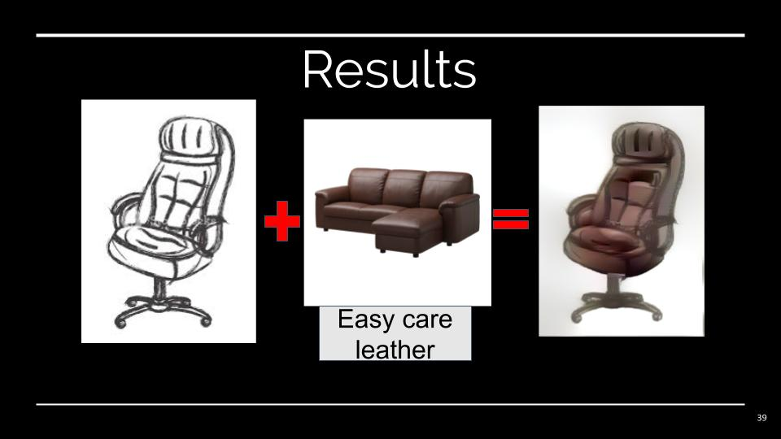
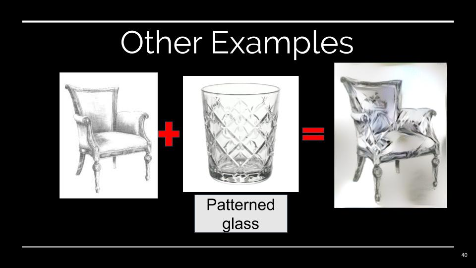
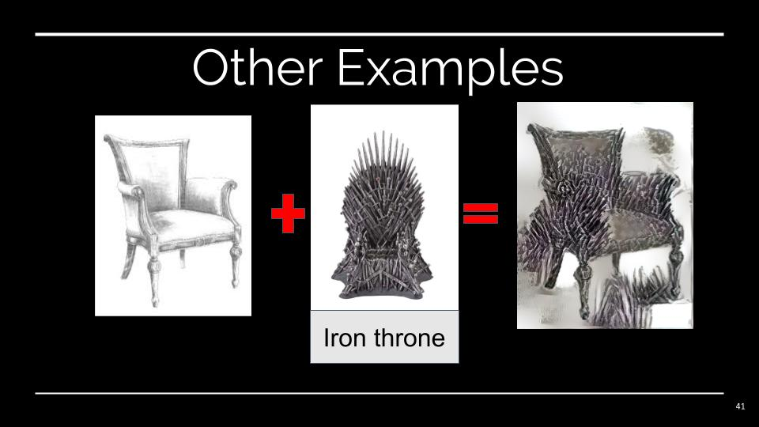

#  DeepDeco

[](https://opensource.org/licenses/MIT)

DeepDeco generates customizable interior design images with sketches and text description. It uses neural style transfer and Word2Vec style search.

Resources: [slides](http://http://bit.ly/deepdecoppt)


## Setup

Clone repository and update python path

```
git clone https://github.com/peter0083/DeepDeco.git
cd DeepDeco
```

## Simple Usage

### via API

In a terminal, execute the following command:

```bash
curl -F "file=@data/images/chair_sketch.jpeg" -F "text='ice cold patterned glass'" -X POST http://deepdeco.club/image --output flask_output.gif
```

## Advanced Usage

### local inference 

**It is recommended to run this inference script on AWS EC2 with GPU for optimal result.**

1. setup your `awscli` credentials (required to download the dataset)
2. run 'inference_aws.py' 

```bash
python inference_aws.py --input "ice cold patterned glass" --content path/to/designer_sketch.jpg --speed "medium"
```

## Results







## Dependencies

*Deep Photo Style Transfer*

* [Tensorflow](https://www.tensorflow.org/)
* [Numpy](www.numpy.org/)
* [Pillow](https://pypi.python.org/pypi/Pillow/)
* [Scipy](https://www.scipy.org/)
* [PyCUDA](https://pypi.python.org/pypi/pycuda)

*Style Search Engine*

* [Sklearn](https://scikit-learn.org/stable/)
* [Pandas](https://pandas.pydata.org/)

*Installation*

To install the packages above, please run:

```
pip install -r requirements.txt
```

### Download the VGG-19 model weights for style transfer
The VGG-19 model of tensorflow is adopted from [VGG Tensorflow](https://github.com/machrisaa/tensorflow-vgg) with few 
modifications on the class interface. The VGG-19 model weights is stored as .npy file 
and could be download from [Google Drive](https://drive.google.com/file/d/0BxvKyd83BJjYY01PYi1XQjB5R0E/view?usp=sharing) or [BaiduYun Pan](https://pan.baidu.com/s/1o9weflK). 
After downloading, copy the weight file to the **./project/vgg19** directory

### Download the Deep Lab V3 weights
Download DeepLab V3 weights from [DeepLabV3 Tensorflow](http://download.tensorflow.org/models/deeplabv3_pascal_train_aug_2018_01_04.tar.gz).
After downloading the file, copy the weight file to **src/ftdeepphoto/deeplab/models/** directory

### Download the GloVe 6B 300d weights
Download GloVe 6B 300d weights from [Stanford NLP group](http://nlp.stanford.edu/data/glove.6B.zip). 
Unzip the zip file and move `glove.6B.300d.txt` to the **src/stylesearch/pickles/glove.6B/** directory.

## Build Environment

```
AWS
Deep Learning AMI (Ubuntu) Version 13.0 (ami-00499ff523cc859e6)
Comes with latest binaries of deep learning frameworks pre-installed in separate virtual environments: 
MXNet, TensorFlow, Caffe, Caffe2, PyTorch, Keras, Chainer, Theano and CNTK. 
Fully-configured with NVidia CUDA, cuDNN and NCCL as well as Intel MKL-DNN
Platform: Ubuntu
Image Size: 75GB
```

## Train

1. to load different Word2Vec weights to the style search engine, run the following script:

```bash
python src/stylesearch/train.py --weight_path /path/to/your_word2vec_weight.txt
```

2. to train style transfer model with your own images, run the following script:

```bash
python src/ftdeepphoto/style_fpst.py # see arguments below
```

Remember to specify the following arguments when you run the train script.

```bash
        --style /path/to/image_style_to_transfer.jpg \
        --style-seg /path/to/style_image_segmentation_map.jpg \
        --checkpoint-dir directory_to_checkpoint/ \
        --train-path dir_to_training_images/ \
        --resized-dir dir_to_resized_training_images/ \
        --seg-dir dir_to_training_segmaps/ \
        --vgg-path vgg/imagenet-vgg-verydeep-19.mat \
        --content-weight 1.5e1 \
        --photo-weight 0.005 \
        --checkpoint-iterations 10  \
        --batch-size 1 \
        --epochs 20000 \
        --deeplab-path ../deeplab/models/deeplabv3_pascal_train_aug_2018_01_04.tar.gz \
        --matting-dir matting/
```

## Reference

1. [fast-deep-photo-style-transfer-tf](https://github.com/hyangda/fast-deep-photo-style-transfer-tf) by Handa Yang 
2. Ikea data set by Ivona Tautkute et al

```
@inproceedings{FedCSIS201756,
	author={Ivona Tautkute and Aleksandra Możejko and Wojciech Stokowiec and Tomasz Trzciński and Łukasz Brocki and Krzysztof Marasek,},
	pages={1275--1282},
	title={What Looks Good with my Sofa: Multimodal Search Engine for Interior Design},
	booktitle={Proceedings of the 2017 Federated Conference on Computer Science and Information Systems},
	year={2017},
	editor={M. Ganzha and L. Maciaszek and M. Paprzycki},
	publisher={IEEE},
	doi={10.15439/2017F56},
	url={http://dx.doi.org/10.15439/2017F56},
	volume={11},
	series={Annals of Computer Science and Information Systems}
}
```  

3. "What Looks Good with my Sofa: Multimodal Search Engine for Interior Design" 
by Ivona Tautkute, Aleksandra Możejko, Wojciech Stokowiec, Tomasz Trzciński, 
Łukasz Brocki and Krzysztof Marasek https://arxiv.org/abs/1707.06907

```
@inproceedings{FedCSIS201756,
	author={Ivona Tautkute and Aleksandra Możejko and Wojciech Stokowiec and Tomasz Trzciński and Łukasz Brocki and Krzysztof Marasek,},
	pages={1275--1282},
	title={What Looks Good with my Sofa: Multimodal Search Engine for Interior Design},
	booktitle={Proceedings of the 2017 Federated Conference on Computer Science and Information Systems},
	year={2017},
	editor={M. Ganzha and L. Maciaszek and M. Paprzycki},
	publisher={IEEE},
	doi={10.15439/2017F56},
	url={http://dx.doi.org/10.15439/2017F56},
	volume={11},
	series={Annals of Computer Science and Information Systems}
}
``` 
4. Image icon reference: https://visualpharm.com/assets/93/Chair-595b40b65ba036ed117d0825.svg

## Project Structure
The directory structure of this project is organized in the diagram below: 

```
├── LICENSE
├── README.md             <- The top-level README for developers using this project.
├── flask_output.gif      <- Sample output
├── data
│   ├── coco_stuff        <- COCO Data Set for DeepLab testing.
│   └── images            <- IKEA Data Set for training and inference.
│
├── webapp                <- Scripts for Flask API
│
├── output                <- Sample output images      
│
├── checkpoints           <- Save checkpoints during training and testing.
│
├── requirements.txt      <- The requirements file for reproducing the analysis environment
│
├── src                   <- Source code for use in this project.
│   ├── stylesearch       <- Scripts for Style Search Engine
│   │
│   ├── ftdeepphotosegMaps<- Segmented images during training and inference
│   │
│   ├── ftdeepphoto       <- Scripts for Deep Photo Style Transfer (TensorFlow)
│   │
│   ├── checkpoints       <- Save checkpoints during training and testing.
│   │
│   └── tests             <- Unit tests for pytest.
│
└── tox.ini               <- tox file with settings for running tox; see tox.testrun.org
```

## Contact

Peter Lin: peter.tingyao@gmail.com